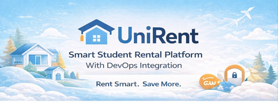
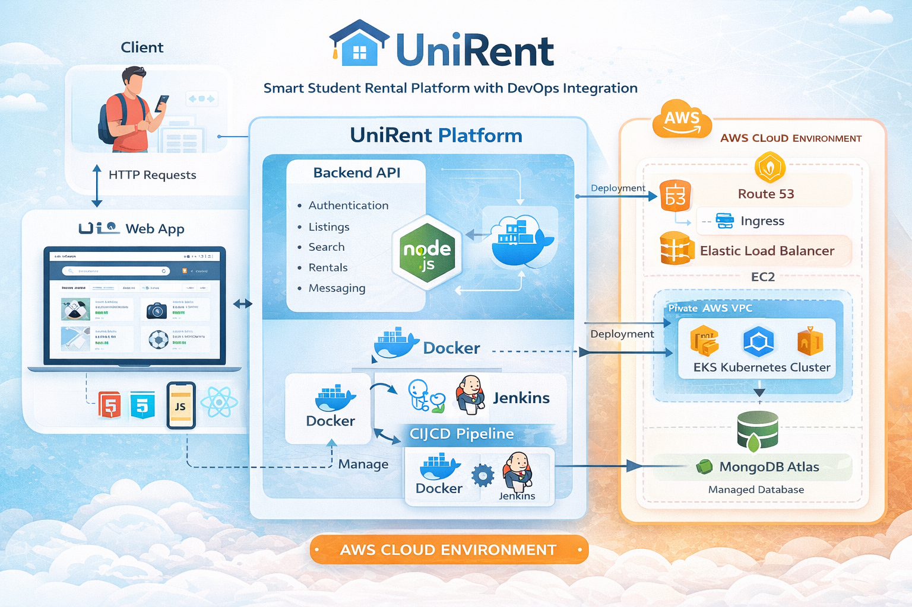
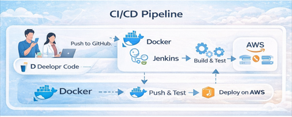
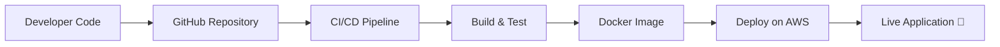

  

<h2 align="center"> UniRent-A Smart Student Rental Platform with DevOps Integration</h2>

  

---

---

##  Problem Statement

In university environments, students often require items such as books, electronics, and essentials for short durations. However, there is no centralized, trusted platform for peer-to-peer rentals.

This results in:

* Unnecessary spending on rarely used items
* Lack of affordable rental options
* Unstructured and insecure transactions
* No centralized system for listings and rentals
* Poor communication between users

---

##  Solution Overview

UniRent is a **full-stack web platform** that enables students to rent and share items within their campus community.

It provides:

* Secure authentication and user management
* Smart item discovery and filtering
* Seamless rental process
* DevOps-enabled scalable deployment

---

## 🛠️ Tech Stack

| Layer            | Technology                    |
| ---------------- | ----------------------------- |
| Frontend         | HTML, CSS, JavaScript / React |
| Backend          | Node.js                       |
| Database         | MongoDB                       |
| Containerization | Docker                        |
| Cloud            | AWS                           |
| CI/CD            | GitHub Actions, Jenkins       |

---

## 🧰 Tools & Technologies

  

---

## 🏗️ Architecture Diagram

### 🧠 Architecture Explanation

* Frontend interacts with backend APIs
* Backend handles business logic and authentication
* MongoDB stores all application data
* Docker ensures consistency across environments
* AWS enables scalable deployment

---

## ⚙️ Core Features

### 🔐 Authentication

* Secure login/signup system
* Role-based access

### 🔍 Search & Filtering

* Smart item discovery
* Filter by category, price, availability

### 📦 Item Listing

* Upload items with images
* Manage pricing and availability

### 💬 User Interaction

* Connect renters and owners
* Request-based rental system

### 📊 Dashboard

* Track listings and rentals
* Monitor user activity

### ⚡ Performance

* Fast and responsive UI
* Optimized user experience

---

## 🔄 DevOps Implementation

This project follows modern DevOps practices:

1. Version Control using Git & GitHub
2. CI/CD pipeline using GitHub Actions / Jenkins
3. Docker-based containerization
4. AWS cloud deployment
5. Automated build and deployment workflow

---

## 🚀 CI/CD Workflow

---

##  Aim of the Project

To build a **scalable, production-ready rental platform** integrating:

* Full-stack development
* Cloud computing
* DevOps automation

---

## 🎓 Learning Outcomes

* Full-stack web development
* REST API development
* MongoDB database management
* Docker containerization
* CI/CD pipeline setup
* AWS deployment
* Real-world system design

---

## 🏆 Impact & Benefits

### 👨‍🎓 For Students

* Cost-effective rentals
* Easy access to resources
* Trusted platform

### 💼 For Developers

* Strong portfolio project
* Real-world DevOps implementation
* Placement-ready project

---

## 🔮 Future Enhancements

* 💳 Payment integration
* 🤖 AI recommendations
* 📱 Mobile application
* ⭐ Ratings & reviews
* 🔔 Notifications

---

## 🧠 Why This Project Stands Out

* Real-world problem solving
* DevOps integration
* Scalable architecture
* Full-stack implementation
* Portfolio-ready

---

## 👨‍💻 Author

**Abhishek Yadav**
B.Tech CSE (DevOps Specialization)

---

## ⭐ Support

If you like this project, give it a ⭐ on GitHub!

---

