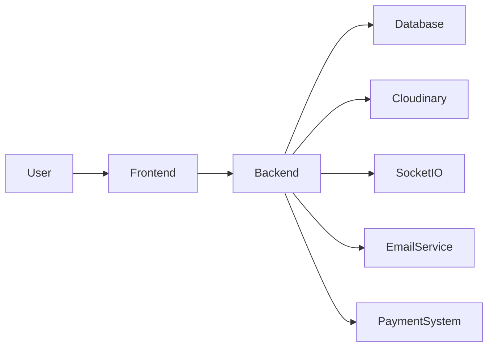

# 🚀 UniRent – Smart Campus Rental Ecosystem

> 🧠 *Reimagining student life through a secure, AI-powered rental marketplace.*

---

# 📄 PAGE 1 — 🌟 Introduction

## 🔥 What is UniRent?

UniRent is a **peer-to-peer rental platform** designed exclusively for university students to rent, lend, and share everyday items within campus.

🎯 Built with:

* Full Stack Development
* DevOps Practices
* Real-world Problem Solving

---

# 📄 PAGE 2 — 🎯 Problem & Vision

## ❗ Problem

Students face:

* High cost of buying items
* Temporary needs (projects, events)
* Underutilized resources

## 💡 Vision

Create a **trusted campus ecosystem** where:

> “Everything you need is already available — just rent it.”

---

# 📄 PAGE 3 — ⚙️ Tech Stack

## 🛠 Core Technologies

| Layer    | Technology        |
| -------- | ----------------- |
| Frontend | React + Tailwind  |
| Backend  | Node.js + Express |
| Database | MongoDB           |
| Storage  | Cloudinary        |
| Chat     | Socket.io         |
| Email    | Nodemailer        |
| DevOps   | Docker            |
| Cloud    | AWS / OCI         |

---

# 📄 PAGE 4 — ✨ Key Features

## 🔐 Security First

* JWT Authentication
* University Email Verification
* OTP Return Confirmation

## 💳 Smart Transactions

* Rent + Deposit system
* Escrow-based payments

## 🧠 Intelligence Layer

* AI price suggestion
* Trust score system

## 💬 Interaction

* Real-time chat
* Reviews & ratings

---

# 📄 PAGE 5 — 🔄 Complete Workflow

## 🔁 End-to-End Flow

```mermaid
flowchart TD
A[User Signup/Login] --> B[Upload Item]
B --> C[Item Listed]
C --> D[User Searches Item]
D --> E[Send Rental Request]
E --> F[Owner Approves]
F --> G[Payment (Rent + Deposit)]
G --> H[Rental Active]
H --> I[Return Initiated]
I --> J[OTP Generated]
J --> K[Owner Verifies OTP]
K --> L[Deposit Refunded]
L --> M[Review & Rating]
```

---

# 📄 PAGE 6 — 🏗️ System Architecture



## 🧩 Layers

* UI Layer → React
* API Layer → Node.js
* Data Layer → MongoDB
* Real-time → Socket.io
* DevOps → Docker

---

# 📄 PAGE 7 — 📊 Core Modules

## 📦 Modules Overview

### 👤 User Module

* Authentication
* Profile
* Trust score

### 📦 Item Module

* Upload
* Edit
* Delete

### 📅 Rental Module

* Booking
* Availability
* Status tracking

### 💳 Payment Module

* Deposit handling
* Refund system

### 💬 Chat Module

* Real-time communication

---

# 📄 PAGE 8 — 🚀 Deployment & Future

## 🚀 Deployment

* Docker containerization
* Cloud-ready (AWS / OCI)
* CI/CD pipeline ready

## 🔮 Future Enhancements

* Mobile App 📱
* AI Recommendation Engine 🤖
* QR Code Return System 📷
* Push Notifications 🔔

---

# 🎯 Why This Project Stands Out

✅ Real-world use case
✅ Secure transaction flow
✅ DevOps integration
✅ Scalable architecture
✅ Startup-level thinking

---

# 👨‍💻 Author

**Abhishek Yadav**
B.Tech CSE (DevOps Specialization)

---

# ⭐ Support

If you like this project, give it a ⭐ on GitHub!

