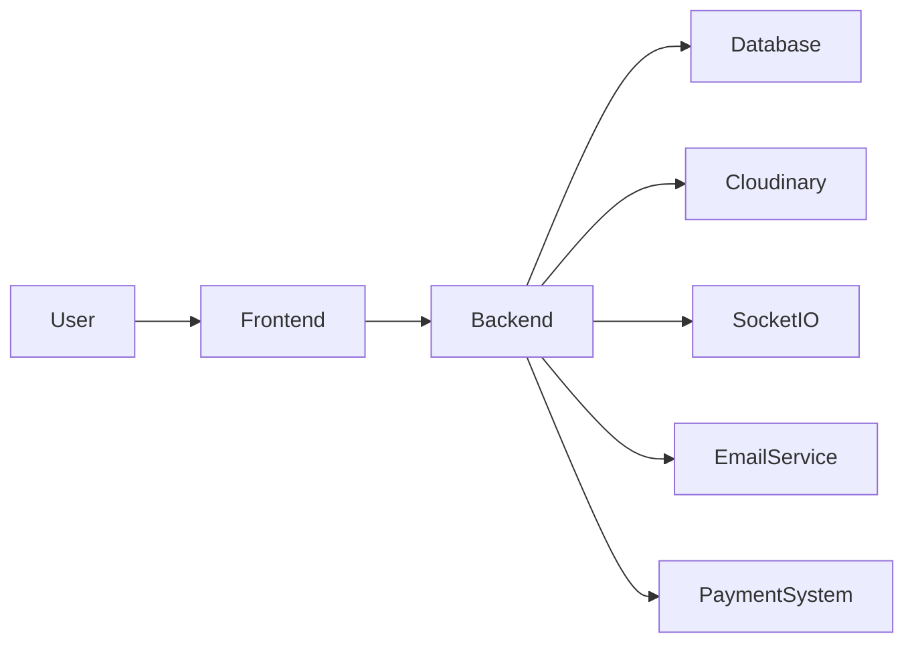

# 🚀 UniRent – Smart Campus Rental Ecosystem

> 🧠 *Reimagining student life through a secure, AI-powered rental marketplace.*

---

# 📄 PAGE 1 — 🌟 Introduction

## 🔥 What is UniRent?

UniRent is a **peer-to-peer rental platform** designed exclusively for university students to rent, lend, and share everyday items within campus.

🎯 Built with:

* Full Stack Development
* DevOps Practices
* Real-world Problem Solving

---

# 📄 PAGE 2 — 🎯 Problem & Vision

## ❗ Problem

Students face:

* High cost of buying items
* Temporary needs (projects, events)
* Underutilized resources

## 💡 Vision

Create a **trusted campus ecosystem** where:

> “Everything you need is already available — just rent it.”

---

# 📄 PAGE 3 — ⚙️ Tech Stack

## 🛠 Core Technologies

| Layer    | Technology        |
| -------- | ----------------- |
| Frontend | React + Tailwind https://in.images.search.yahoo.com/images/view;_ylt=AwrKGGyq3LtpMfYU5hO9HAx.;_ylu=c2VjA3NyBHNsawNpbWcEb2lkAzM4MzFhYjkwYjI3OGNjYmU0MzUyMDEwNzVlZWJjZGE1BGdwb3MDMTUEaXQDYmluZw--?back=https%3A%2F%2Fin.images.search.yahoo.com%2Fsearch%2Fimages%3Fp%3DReact%2B%252B%2BTailwind%26type%3DG210IN885G91992M852d8dae20725c7214226eb13f60fd6e%26fr%3Dmcafee%26fr2%3Dpiv-web%26tab%3Dorganic%26ri%3D15&w=680&h=383&imgurl=blogger.googleusercontent.com%2Fimg%2Fb%2FR29vZ2xl%2FAVvXsEgAhCKjcULr-fPgCBgFvWv0BZn4i9mRCniG44KPTCSeAIRxrdxUGa3EC2TvFsyGP0y4-IggUACKSBiN27LBIuyF0P4HTkyRDSJyqRz0RD-j7ewsYS7k3pSxD-JM4PrYmTFRvhJkc8gxySgnK_BEMXn4xcdFTKsv0xT-QDl22r9sJOyJZTDyVK7BvliK%2Fw1600%2Fe0af14c49a68d10630288d5382cad7076430220f.webp&rurl=https%3A%2F%2Fthesevendigitaldiary.blogspot.com%2F2023%2F10%2Fhow-to-use-tailwind-css-in-react-js.html&size=24KB&p=React+%2B+Tailwind&oid=3831ab90b278ccbe435201075eebcda5&fr2=piv-web&fr=mcafee&tt=How+to+Use+Tailwind+CSS+in+a+React+JS+Project&b=0&ni=21&no=15&ts=&tab=organic&sigr=7u14ljmIoi4O&sigb=p8hKNuTp4yNt&sigi=002CSBvogWIH&sigt=EONkwGBS4UKs&.crumb=/1xvtR9QGp0&fr=mcafee&fr2=piv-web&type=G210IN885G91992M852d8dae20725c7214226eb13f60fd6e |
| Backend  | Node.js + Express |
| Database | MongoDB           |
| Storage  | Cloudinary        |
| Chat     | Socket.io         |
| Email    | Nodemailer        |
| DevOps   | Docker            |
| Cloud    | AWS / OCI         |

---

# 📄 PAGE 4 — ✨ Key Features

## 🔐 Security First

* JWT Authentication
* University Email Verification
* OTP Return Confirmation

## 💳 Smart Transactions

* Rent + Deposit system
* Escrow-based payments

## 🧠 Intelligence Layer

* AI price suggestion
* Trust score system

## 💬 Interaction

* Real-time chat
* Reviews & ratings

---

# 📄 PAGE 5 — 🔄 Complete Workflow

## 🔁 End-to-End Flow

```mermaid
flowchart TD
A[User Signup/Login] --> B[Upload Item]
B --> C[Item Listed]
C --> D[User Searches Item]
D --> E[Send Rental Request]
E --> F[Owner Approves]
F --> G[Payment (Rent + Deposit)]
G --> H[Rental Active]
H --> I[Return Initiated]
I --> J[OTP Generated]
J --> K[Owner Verifies OTP]
K --> L[Deposit Refunded]
L --> M[Review & Rating]
```

---

# 📄 PAGE 6 — 🏗️ System Architecture



## 🧩 Layers

* UI Layer → React
* API Layer → Node.js
* Data Layer → MongoDB
* Real-time → Socket.io
* DevOps → Docker

---

# 📄 PAGE 7 — 📊 Core Modules

## 📦 Modules Overview

### 👤 User Module

* Authentication
* Profile
* Trust score

### 📦 Item Module

* Upload
* Edit
* Delete

### 📅 Rental Module

* Booking
* Availability
* Status tracking

### 💳 Payment Module

* Deposit handling
* Refund system

### 💬 Chat Module

* Real-time communication

---

# 📄 PAGE 8 — 🚀 Deployment & Future

## 🚀 Deployment

* Docker containerization
* Cloud-ready (AWS / OCI)
* CI/CD pipeline ready

## 🔮 Future Enhancements

* Mobile App 📱
* AI Recommendation Engine 🤖
* QR Code Return System 📷
* Push Notifications 🔔

---

# 🎯 Why This Project Stands Out

✅ Real-world use case
✅ Secure transaction flow
✅ DevOps integration
✅ Scalable architecture
✅ Startup-level thinking

---

# 👨‍💻 Author

**Abhishek Yadav**
B.Tech CSE (DevOps Specialization)

---

# ⭐ Support

If you like this project, give it a ⭐ on GitHub!

